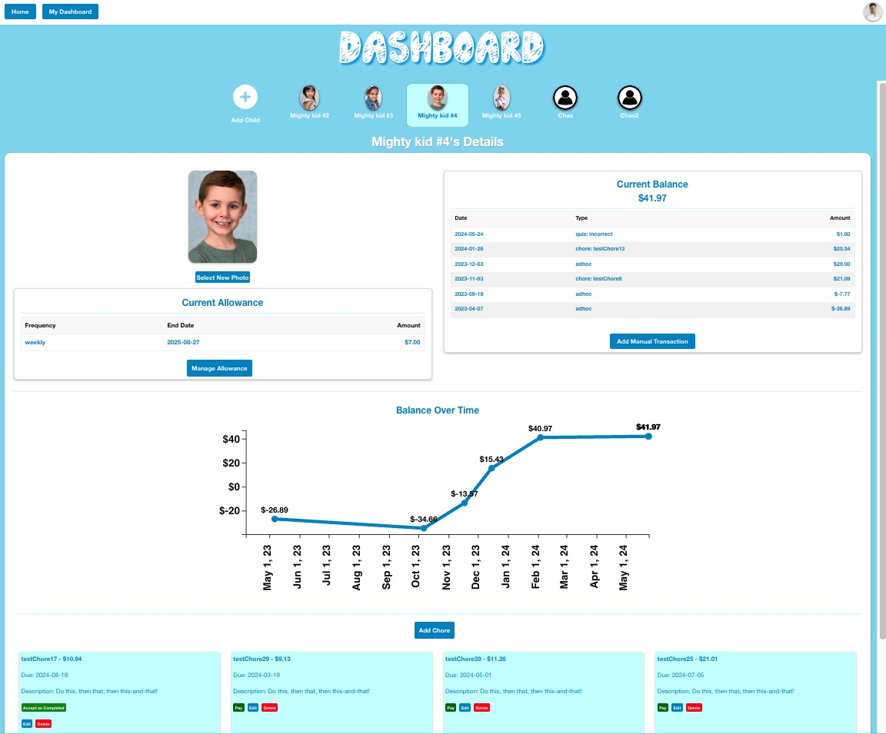

# Chore Champion

## Summary

A web app that allows families to keep track of allowances and chores.

Child features
- See assigned chores, submit completed chores for payment, and see which payments are pending
- See current balance, historical transactions, and a chart of balances over time
- Weekly quiz to earn additional money

Parent features
- Assign a weekly or monthly allowance
- Create an ad hoc debit/credit
- Assign new chores, accept chores as complete and pay the amount due, edit & delete chores
- Send an email invite for a new child, with a registration code

Shared features
- Authenticated login
- Upload profile pic
- Change nickname or email

## Usage

Navigate to [https://www.example.com](https://www.example.com)

Use these test logins...

   ```
   username: "testParent2"  
   password: "password"
   ```

   ```
   username: "testChild4"  
   password: "password"
   ```



## Technologies

- D3 (graphing balances over time)
- Passport (authentication)
- Nodemailer (email registration links)
- React/Express/PostgreSQL (Objection/Knex)

## Backlog/Roadmap

- Register and login using Google account
- Allow children to request 'cash-out' amounts from their bala
- Setup a new child without them having an email
- Add to profile page (change password, change username, view/edit family name)
- Allow for text invites to children for registration
- Incorporate the child registration code into the registration link
- Parent can see outstanding child invites
- Archive chores (set to inactive) rather than delete
- Ability to archive a child
- Parent can see chores past due date and edit/archive/pay them
- Add more parents to a family (e.g., spouses)
- Child can propose a new chore to a parent

## Technical Backlog

- API test suite
- End-to-end test suite